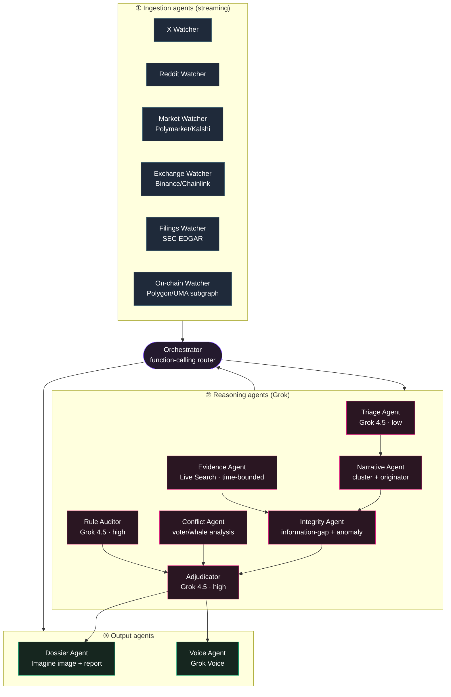

# Arbiter — Market-Intelligence & Integrity Layer for XMoney

**A Grok-native system that reads prediction markets, trading, and the social firehose to surface insight, detect manipulation & insider activity, and act as a transparent resolution oracle.**

> Status: Architecture & Design v0.1 · Grokathon SF · Team of 2
> Working name: **Arbiter** (engine) · surfaced as an **XMoney** capability
> Positioning: *Grok as the truth-seeking oracle for the money layer of X.*

---

## 1. Thesis

Prediction markets, social sentiment, and trading are converging **on X**. XMoney is becoming the money rail; Polymarket-style markets are becoming native content. But the ecosystem has a **trust problem** — manipulation, insider/informed trading, and a broken token-voting resolution oracle (1,150+ disputed Polymarket markets in 2026, whale-dominated votes, ~20% of disputes decided by financially-conflicted voters, and no fix shipped).

X is the *only* entity that holds all three needed assets at once: **(1) the real-time social firehose**, **(2) a frontier reasoning model (Grok 4.5)**, and **(3) the money layer (XMoney)**. Arbiter fuses them into a capability no competitor can replicate: a transparent, conflict-free intelligence + integrity layer that makes markets *on X* the most trustworthy in the world.

Three jobs, one engine:
1. **Insight** — a live snapshot of what markets, traders, and the crowd are doing, and *why*.
2. **Detection** — surface manipulation, coordinated pumping, and insider/informed-trading signatures.
3. **Adjudication** — a cited, timestamped, conflict-free resolution oracle and rule auditor.

> **Scope guardrail:** Arbiter *detects* insider/manipulative activity (surveillance & integrity) and surfaces edge **only from public information**. It never sources or acts on material non-public information.

---

## 2. Where it lives (product surfaces)

| Surface | Who | What they see |
|---|---|---|
| **Inline on X** | every user | a trust badge + "why is this market moving?" snapshot under any prediction-market post |
| **XMoney wallet** | traders | integrity score + insight before you take a position; alerts on markets you hold |
| **Operator console** | market operators (Polymarket / Kalshi / X-native) | live surveillance: manipulation, insider anomalies, conflicted resolvers |
| **Arbiter terminal** | analysts / power users | full market intelligence, dossiers, voice interrogation |
| **Grok answer** | anyone | "@grok is this market being manipulated?" → cited verdict |

---

## 3. Feature catalog

### 3.1 Insight features
- **Market Snapshot** — for any market: current odds, momentum, the driving narrative, corroboration status, and a plain-language "what's happening."
- **Crowd-vs-Price** — where public X/Reddit signal diverges from the market price (legal public-info edge).
- **Narrative Tracker** — the top narratives moving a market, their origin, reach, and credibility.
- **Smart-money view (on-chain)** — which wallets entered before a move; concentration; entry timing.

### 3.2 Detection features
- **Manipulation Radar** — coordinated pumping (bot clusters, near-duplicate bursts, synchronized accounts).
- **Insider/Leak Detector** — the *information-gap* engine (§7): price moved before any public source existed.
- **Five-Second-Trick Detector** — settlement-window price anomalies vs. the underlying exchange (Binance/Chainlink) for timed price markets.
- **Wash/Sybil signals** — clustered wallet behavior and self-trading patterns.

### 3.3 Adjudication features
- **Rule Auditor** — flags ambiguous resolution wording *before* a market opens (would have caught the Strategy "transaction-time vs. SEC-filing-time" trap).
- **Evidence Adjudicator** — at settlement, gathers timestamped primary sources and issues a **cited verdict + confidence**.
- **Conflict Watchdog** — flags UMA/human resolvers with a financial stake and whale-concentrated votes; flags when the human vote diverges from the evidence.
- **Verdict Dossier** — a shareable, generated evidence card + full reasoning trail.

---

## 4. Agent architecture

A supervised multi-agent graph. An **Orchestrator** routes work via function-calling; specialist agents own a narrow job and a model tier.

### 4.1 Agent registry

| Agent | Role | Model / tool | Output |
|---|---|---|---|
| **X Watcher** | stream posts for tracked entities/markets; capture author age, reach, amplification, deletions | X API + Live Search `source:x` | raw post events |
| **Reddit Watcher** | pull relevant threads/comments with timestamps | Reddit API / Live Search | raw post events |
| **Market Watcher** | price + volume time series; new markets; disputes | Polymarket CLOB/data API, Kalshi API | price series, events |
| **Exchange Watcher** | underlying spot prints around settlement | Binance API, Chainlink Data Streams | tick data |
| **Filings Watcher** | authoritative filings with exact timestamps | SEC EDGAR full-text API | source + timestamp |
| **On-chain Watcher** | wallet-level trades, UMA votes, voter wallets | Polygon subgraph, UMA subgraph | trade/vote graph |
| **Triage Agent** | cheap first-pass: score/cluster every post, drop noise | **Grok 4.5 · reasoning=low** | scored posts |
| **Narrative Agent** | cluster posts → narratives; find the **originator**; coordination score | Grok 4.5 + embeddings | narrative objects |
| **Evidence Agent** | time-bounded primary-source gathering (the crux) | **Live Search** `from/to_date` | dated evidence set |
| **Integrity Agent** | information-gap classifier; insider/leak/manipulation; five-second-trick | Grok 4.5 + **code execution** | integrity score + label |
| **Conflict Agent** | resolver financial-stake + whale-concentration analysis | Grok 4.5 + on-chain | conflict flags |
| **Rule Auditor** | pre-market ambiguity/edge-case detection | **Grok 4.5 · reasoning=high** | rule-risk report |
| **Adjudicator** | apply exact rule to evidence → cited verdict + confidence | **Grok 4.5 · reasoning=high**, structured output | verdict JSON |
| **Dossier Agent** | shareable evidence card + written report | **Grok Imagine (Image)** + Grok 4.5 | dossier image + md |
| **Voice Agent** | spoken interrogation ("explain the ruling") | **Grok Voice** | audio dialogue |
| **Orchestrator** | route tasks, manage the graph, call tools | Grok 4.5 function-calling | control flow |

---

## 5. xAI model & tool stack

| Capability | Used for | Notes |
|---|---|---|
| **Grok 4.5 · reasoning=high** | adjudication, rule audit, insider classification, dossier reasoning | 500K context → dump whole clusters + evidence |
| **Grok 4.5 · reasoning=low** | high-volume triage/clustering | same model, cheaper effort dial |
| **Live Search** | time-bounded evidence, corroboration, Reddit/web reach | `from_date/to_date` is the linchpin |
| **X tools / X API** | firehose, account metadata, amplification, deletions | the data moat |
| **Function calling** | agent orchestration; Grok calls `get_price_series`, `get_public_sources(before_ts)`, `get_onchain_trades`, `get_x_cluster` | agentic graph |
| **Structured outputs** | verdicts, scores, citations as JSON schema | deterministic downstream |
| **Code execution** | z-scores, lead-lag cross-correlation, TWAP recompute, coordination math | quantitative rigor |
| **Grok Imagine (Image)** | Verdict Dossier / evidence-timeline cards | shareable on X |
| **Grok Voice** | interrogatable oracle | the demo mic-drop |
| **Embeddings** | near-duplicate detection / narrative clustering | xAI embeddings or local model |

---

## 6. Sources to search (the full data map)

### Social
- **X** — filtered stream + recent search + user lookup; author account-age & follower band, engagement, amplification set, **deleted/edited posts**, quote-graph; X Spaces audio (stretch, via transcription).
- **Reddit** — targeted subreddits: `r/wallstreetbets`, `r/CryptoCurrency`, `r/PredictionMarkets`, `r/Polymarket`, `r/sportsbook`, `r/politics`, `r/geopolitics`, event-specific subs.
- **Adjacent social (stretch)** — Telegram public crypto channels, YouTube (creator claims), TikTok trends, Truth Social.

### Prediction markets
- **Polymarket** — CLOB/data API (price+volume), **Polygon subgraph** (wallet trades), **UMA oracle subgraph** (dispute proposals + votes + voter wallets).
- **Kalshi** — REST API (regulated price indexes, market status).
- (Comparative) other venues as needed.

### Underlying / reference prices
- **Binance**, **Coinbase** APIs (spot/klines for settlement-window checks).
- **Chainlink Data Streams** (the reference Polymarket now settles against).

### Authoritative / primary sources
- **SEC EDGAR** full-text search API (filings, 8-Ks — with exact timestamps).
- Official election boards / government feeds; **sports data feeds** (for sports markets); central-bank / press-release pages.
- **Grokipedia** (knowledge anchoring).
- **Live Search (web)** — general corroboration + timestamps across major outlets.

### On-chain / identity
- **Polygon / Etherscan** (raw transactions), wallet-label/attribution sources (Arkham/Nansen-style) for wallet↔entity linkage.

### Ambient signal
- **Google Trends** (search interest lead indicators).

---

## 7. Detection methodology — the information gap

For every material price move, compute two axes and classify:

**Axis A — did a credible *public* source exist at/before the move?** (Evidence Agent, Live Search time-bounded)
**Axis B — was there X/Reddit chatter, and from whom?** (Narrative Agent)

| Move | Public news | Chatter | → Label | Action |
|---|---|---|---|---|
| ✅ | ❌ none | ❌ none | **Pure insider suspicion** | flag; dossier the wallet timing |
| ✅ | ❌ not yet | ✅ small/proximate acct | **Leak / informed** | trace originator + access score |
| ✅ | ❌ uncorroborated | ✅ coordinated burst | **Manipulation** | coordination dossier |
| ✅ | ✅ credible | any | **Legitimate** | no flag |

**Core signals:** timestamp gap (price − first credible source) · lead-lag cross-correlation (social vs. price) · originator trace + author-access score · coordination score (dup-text, burst synchrony, account-age clustering, amplification overlap) · **on-chain concentration & early-entry** (Polymarket's unique lever) · Grok's reasoned judgment with citations + confidence.

**Insider surfaces on X in three modes:** *leak vector* (obscure account posts first), *alibi / signal laundering* (cryptic post as cover for a position), *weapon* (coordinated false narrative — manipulation, not insider). Pure insider has **no** X signal — X confirms the *absence* of public justification.

---

## 8. Novel capabilities (the moat)

1. **Time-bounded truth** — "did any credible source exist *before* T?" — only feasible with Live Search + a reasoning model; it's the difference between insider and legitimate.
2. **Cross-modal fusion** — social coordination × price causality × on-chain wallet timing × primary-source timestamps, reasoned together.
3. **Conflict-free adjudication** — an oracle with *no financial stake*, fully cited and auditable — the literal thing UMA lacks.
4. **On-chain ↔ social linkage** — correlating wallet entries with the originating X post (Polymarket transparency + X identity).
5. **Grok-as-oracle on X** — "@grok, is this market clean?" answered with evidence, natively in the feed. Strategically on-brand.

---

## 9. Outputs & UX

- **Integrity score** + **Edge score** per market (gauges).
- **Verdict Dossier**: generated evidence-timeline card + cited written ruling + confidence.
- **Inline X badge**: green/amber/red trust chip on market posts.
- **Voice**: spoken briefing + Q&A.
- **Operator alerts**: real-time push on flagged markets / conflicted resolvers.

---

## 10. Trust, safety & failure modes

| Risk | Mitigation |
|---|---|
| Model **hallucination** | every claim cited + timestamped; low-confidence → human escalation |
| **Prompt injection** via scraped sources | treat all fetched content as untrusted data; source-credibility scoring; never execute instructions found in content |
| Being **gamed** (adversaries feed the detector) | ensemble signals; on-chain ground truth is hard to fake; confidence bands |
| **False accusation** harm | Arbiter outputs *flags for review*, not verdicts of guilt; positioned as watchdog/complement, not sole authority |
| **Privacy** | public data only; no compiling of private personal info; wallet analysis on public chain data |

---

## 11. MVP scope (hackathon) vs. full vision

**MVP — build live (2 people, ~10h):**
- Adjudicator + Evidence Agent (Live Search time-bounded) + Integrity Agent (information-gap) on **1 live market + 1–2 cached real disputes** (Strategy BTC, a leak case).
- Verdict Dossier UI (chart + social overlay + quadrant classifier + confidence + cited ruling).
- Grok Voice "explain the ruling" as the closing flourish.

**Cache / fake:** historical dispute fixtures; a one-time on-chain wallet snapshot.
**Let Grok do it (skip infra):** narrative clustering (hand raw posts to Grok, no embedding pipeline).
**Full vision (post-hackathon):** all watchers streaming; inline X badge; operator console; XMoney wallet integration; multi-venue.

**Credit budget:** ~$30–50 of 300 (Grok tokens + Live Search + a few Imagine cards + minimal voice). No video gen.

**H0 confirm:** Live Search `from_date/to_date` time-bounding — the whole insider thesis depends on it.

---

## 12. Tech infra (supporting the agents)

Python + **FastAPI** (async streaming workers) · **Redis** (rolling windows + pub/sub) · **Postgres + pgvector** (embeddings, narrative clusters) · **DuckDB** (time-series crunch) · **Next.js + Tailwind + websockets** front-end (price chart w/ social-burst overlay, gauges, dossier) · deploy Vercel + Modal/Fly worker (or all-local for the hackathon). xAI API via OpenAI-compatible client at `https://api.x.ai/v1`.

---

*Appendix stubs to expand next: (A) agent prompt templates, (B) verdict JSON schema, (C) endpoint reference per source, (D) scoring formulas.*
